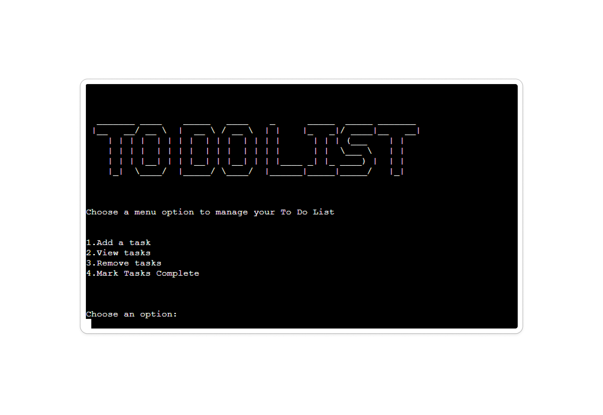
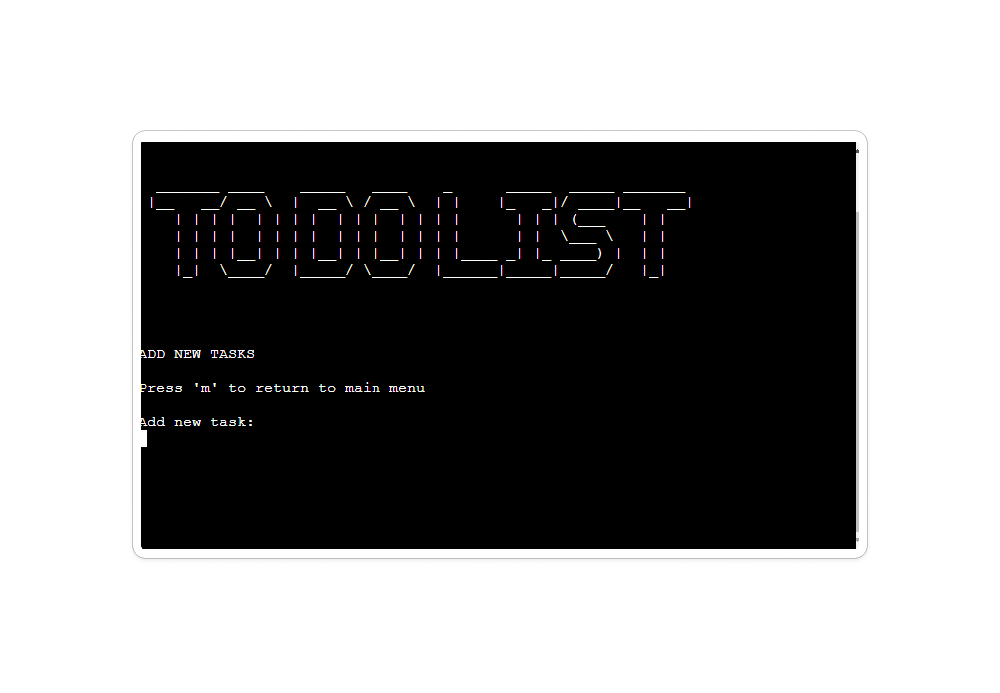
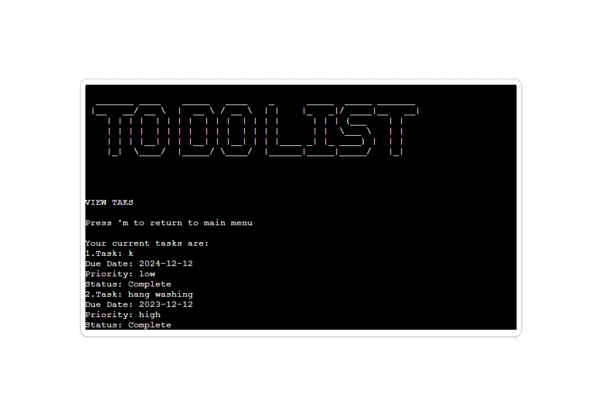
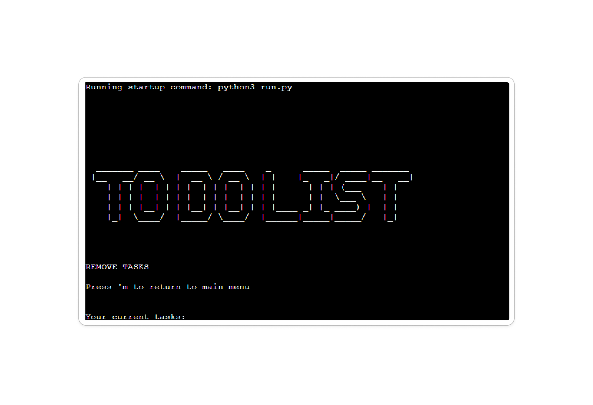
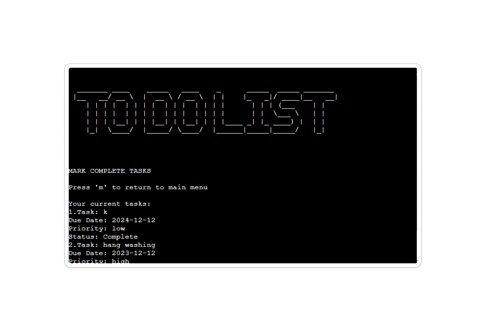

https://blogboard.io/blog/knowledge/how-to-write-a-list-to-a-file-in-python/
https://www.geeksforgeeks.org/clear-screen-python/

# To Do List Application

## A Python command line tool
>This application is a Python command line To Do List manager. Users can add, view, remove, and mark tasks as complete through an intuitive command line interface.

##Table of Contents
 1. [ Pre-Project Planning ](#pre-project-planning)  
 2. [ Features Left to Implement ](#features-left-to-implement)  
 3. [ Technology used ](#technology-used) 
 4. [ Testing ](#testing)  
 5. [ Bugs ](#bugs)  
 6. [ Deployment](#deployment)
 7. [ Credits](#credits)
 8. [ Content](#content)  
 9. [ Acknowledgements](#acknowledgements)

### Pre-Project Planning

> For this project,  I aimed to create a simple command line To Do List application in Python. The Goal was to build a tool that helps users manage their tasks through a straightforward interface.

I mapped out the applications flow in a diagram to understand the user interactions and task management logic required. This helped in structuring the project and identifying key features and functionalities. Please see below for flow diagram. 

### Application Structure

#### Task Management

- **Add Tasks**: Allows users to add new tasks with the description and due date.
- **View Tasks**: Displays a list of all tasks wit their status.
- **Remove Tasks**: Enable users to remove tasks from the list.
- **Mark Tasks Complete**: Marks tasks as complete and updates their status.

#### Data Management

- **JSON STORAGE**: Tasks are saved in a `tasks.json` file for persistence.
- **Data Validation**: Ensures that data entered by the user is correctly formatted.

#### User Interaction

- **Command Line Interface**: The user interacts with the application via a command line menu with options to manage tasks. 

## Game Flow
> When the user starts the application, they are greeted with a menu:

> The user can choose to view tasks, add new tasks, remove tasks, or mark tasks as complete.

**Add Tasks**: 

> A user is prompted to enter a task description, due date, and priority level.

**View Tasks**:

> A user can view their list of tasks. 

**Remove Tasks**:

> A user can see a list of tasks and choose a task number to remove from their task list. 

**Mark Tasks Complete**:

> A user can see their list of tasks and choose a task number to mark as complete. 

**Press m to return to main menu**:

> When in any function in the program, the user has the option to return to the main menu by keying 'm' and pressing enter.

